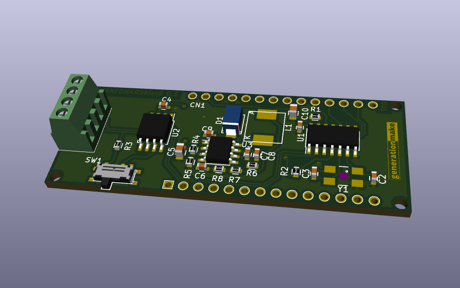
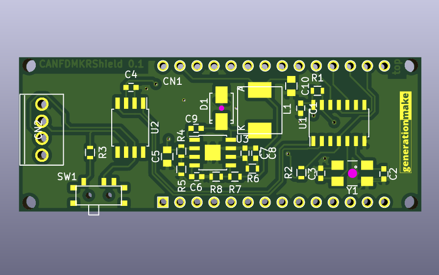
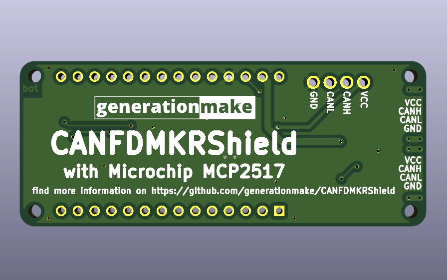

# CANFDMKRShield
Shield with CAN FD Controller MCP2517 for Arduino MKR

## pin usage

### Arduino MKR connector CN1

| **Pin** | **Pin Name** | **Signal**    | **Description**                      |
|:-------:|:------------:|:-------------:|:------------------------------------:|
| 1       | AREF         |               |                                      |
| 2       | DAC0/A0      |               |                                      |
| 3       | A1           |               |                                      |
| 4       | A2           |               |                                      |
| 5       | A3           |               |                                      |
| 6       | A4           |               |                                      |
| 7       | A5           |               |                                      |
| 8       | A6           |               |                                      |
| 9       | 0            |               |                                      |
| 10      | 1            |               |                                      |
| 11      | 2            |               |                                      |
| 12      | 3            | MCP2517_CS1   | option 1 for chip select for MCP2517 |
| 13      | 4            | MCP2517_CS2   | option 2 for chip select for MCP2517 |
| 14      | 5            |               |                                      |
| 15      | 6            |               |                                      |
| 16      | 7            | MCP2517_INT   | interrupt from MCP2517               |
| 17      | 8/MOSI       | SPI_MOSI      | SPI to MCP2517                       |
| 18      | 9/SCK        | SPI_SCK       | SPI to MCP2517                       |
| 19      | 10/MISO      | SPI_MISO      | SPI to MCP2517                       |
| 20      | 11/SDA       |               |                                      |
| 21      | 12/SCL       |               |                                      |
| 22      | 13/RX        |               |                                      |
| 23      | 14/TX        |               |                                      |
| 24      | RESET        |               |                                      |
| 25      | GND          | GND           |                                      |
| 26      | VCC          | 3V3-rail      | supply voltage for board             |
| 27      | VIN          | +5V           | 5V supply output from CAN connector  |
| 28      | 5V0          |               |                                      |

### CAN connector CN2

compatible to Sparkfun Qwiic. JST SH 1mm 4-pin.

| **Pin** | **Signal**    | **Description**                  |
|:-------:|:-------------:|:--------------------------------:|
| 1       | GND           |                                  |
| 2       | CAN_L         |                                  |
| 3       | CAN_H         |                                  |
| 4       | VCC           | input to Arduino, up to 24 V     |

### UAVCAN dronecode connector CN3 and CN4

compatible to UAVCAN dronecode. JST GH 1.25mm 4-pin.

| **Pin** | **Signal**    | **Description**                  |
|:-------:|:-------------:|:--------------------------------:|
| 1       | CANVCC        | up to 5.5 V                      |
| 2       | CAN_H         |                                  |
| 3       | CAN_L         |                                  |
| 4       | GND           |                                  |

CANVCC can be connected to Arduino via diode D2 as desribed in the dronecode spec. The direction of the diode defines wether current is sourced from the connector or supplied into the UAVCAN system. If no connection is desired just leave D2 unpopulated.

## PCB

### Top

### Bottom

## Resources

### Datasheets

 * http://ww1.microchip.com/downloads/en/DeviceDoc/MCP2517FD-External-CAN-FD-Controller-with-SPI-Interface-20005688B.pdf
 
### Arduino Libraries

 * tbd
