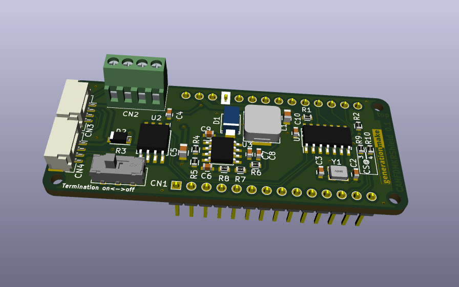
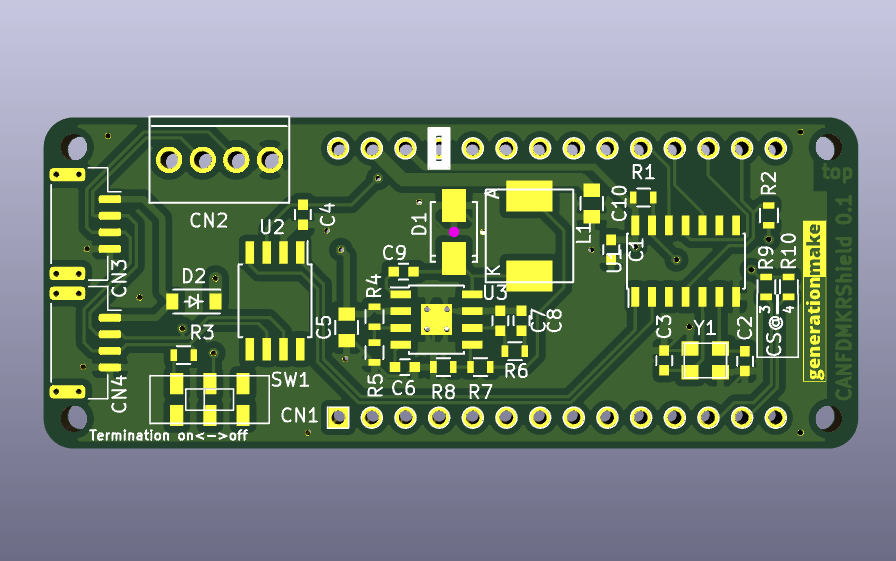

# CANFDMKRShield
Shield with CAN FD Controller MCP2517 for Arduino MKR

## PCB

### Top

### Bottom

## Resources

### Datasheets

 * http://ww1.microchip.com/downloads/en/DeviceDoc/MCP2517FD-External-CAN-FD-Controller-with-SPI-Interface-20005688B.pdf
 
### Arduino Libraries

 * tbd
